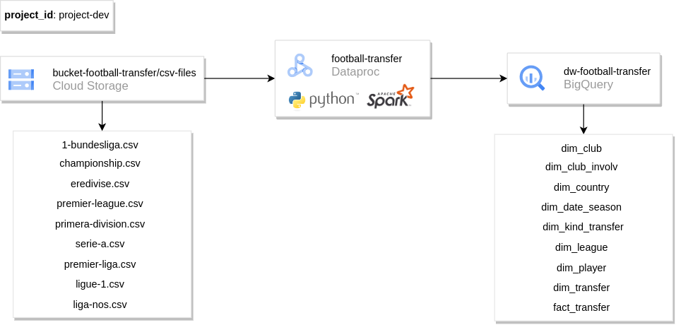
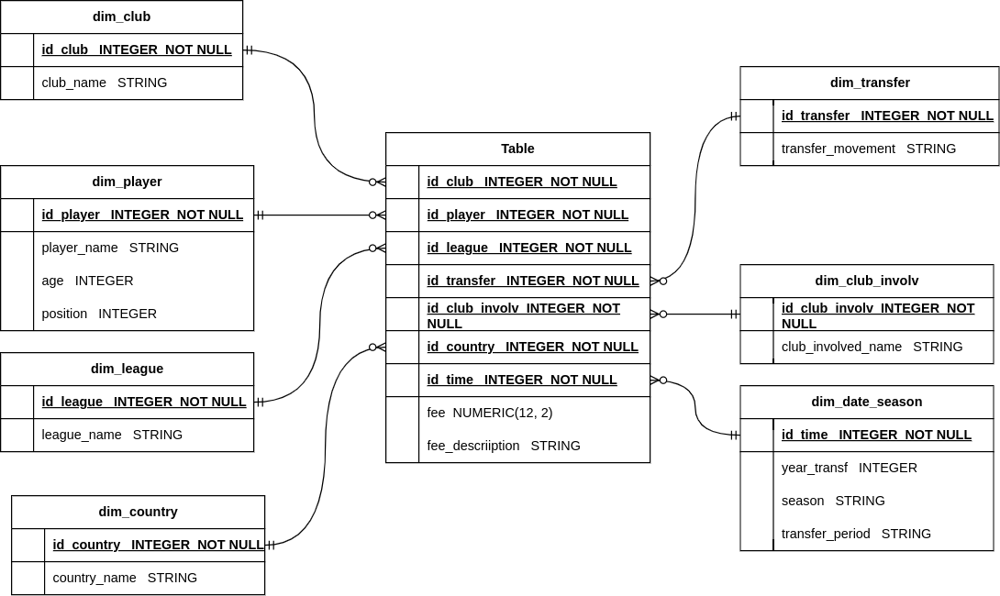

# etl-football-transfer

Este projeto tem como objetivo criar um Data Warehouse (utilizando modelagem tradicional Star Schema) no BigQuery com dados de transferência de jogadores de alguns campeonatos do futebol Europeu desde a temporada 1992/1993, a patir de um dataset do [Kaggle](https://www.kaggle.com/datasets/mexwell/football-player-transfers).


## Dataset Utilizado

O Dataset utilizado é composto pelos arquivos:

- **premier-league.csv** (English Premier League)
- **championship.csv** (English Championship)
- **ligue-1.csv** (French Ligue 1)
- **1-bundesliga.csv** (German 1.Bundesliga)
- **serie-a.csv** (Italian Serie A)
- **primera-division.csv** (Spanish La Liga)
- **liga-nos.csv** (Portugese Liga NOS)
- **eredivisie.csv** (Dutch Eredivisie)
- **premier-liga.csv** (Russian Premier Liga)

Cada arquivo contém a seguinte estrutura:

|Header|Description|Data Type|
|------|-----------|---------|
|club_name|name of club|text|
|player_name|name of player|text|
|position|position of player|text|
|club_involved_name|name of secondary club involved in transfer|text|
|fee|raw transfer fee information|text|
|transfer_movement|transfer into club or out of club?|text|
|transfer_period|transfer window (summer or winter)|text|
|fee_cleaned|numeric transformation of fee, in EUR millions|numeric|
|league_name|name of league club_name belongs to|text|
|year|year of transfer|text|
|season|season of transfer (interpolated from year)|text|
|country|country of league|text|

## Construção do Projeto 

- Os dados de origem foram carregados manualmente no Google Cloud Storage como arquivos `.csv`; 

- O Data Warehouse foi criado manualmente no BigQuery;

- Para o processamento e carga dos dados nas *dimensões* e *fato* foi utilizado o **Google Dataproc** com o **PySpark**;

- Para a criação do **Dataproc Cluster** e envio do **PySpark Job** foi utilizado o `gcloud` via Shell Script.

### Ferramentas

- [Google Cloud Storage](https://cloud.google.com/storage?hl=pt-br)
- [Google BigQuery](https://cloud.google.com/bigquery?hl=pt-br)
- [Google Dataproc](https://cloud.google.com/dataproc?hl=pt-BR) (Imagem: [2.1-debian11](https://cloud.google.com/dataproc/docs/concepts/versioning/dataproc-release-2.1?hl=pt-br))
- [PySpark](https://spark.apache.org/docs/latest/api/python/getting_started/index.html) (Versão: 3.3.0)
- [Python](https://www.python.org/) (Versão: 3.10)


## Estrutura do Projeto

A seguir, uma apresentação do padrão de nomenclatura utilizado e explicação dos principais componentes do projeto.

### Data Pipeline



### Data Warehouse



### GCP

1. project-id criado para este projeto: `project-dev`;
2. Bucket criado para dados de origem: `bucket-football-transfer`;
3. Caminho para os arquivos csv: `bucket-football-transfer/csv-files/`;
4. Dataset criado no BigQuery: `dw-football-transfer`;
3. Dataproc Cluster: `football-transfer`.

### Cluster e Pyspark Job

O arquivo `sh/main.sh` é responsável por criar o cluster do dataproc e enviar o pyspark job. Para isso ele é auxiliado pelos arquivos `create_cluster.sh` e `submit_pyspark.sh`. O primeiro contém as configurações do cluster (região, tipo das máquinas virtuais, tipo de imagem, tempo máximo de inatividade e etc). O segundo arquivo contém informações do job e o do cluster que será utilizado, além de plugins necessários para algumas execuções.

### Arquivo de configuração

Os nomes de buckets, folders, tabelas, campos e demais informações necessárias sobre os arquivos de origem e tabelas de destino foram organizados no arquivo **json**: `configs/etl_football_transfer_config.json`.

### ETL

A fase de processamento e carga dos dados no DW encontra-se no arquivo `etl_football_transfer.py`, auxiliado pelos módulos: 
    - `utils`: Contém funções necessárias ao projeto como Criação de uma Sessão do Spark, funções para leitura e escrita de arquivos do GCS e BigQuery e etc. 
    - `etl_transform`: Contém funções de manipulação dos Spark DataFrames criados no projeto.

## Utilização

### Configuração (OPCIONAL)

Deve-se realizar essas configurações apenas se a estrutura do projeto no GCP (**project-id**, **dataset**, **bucket** e etc) for diferente da apresentada anteriormente.

1. Altear `PROJECT_ID` e `CLUSTER_NAME`:

    No arquivo `sh/main.sh` deve-se substituir o nome do `PROJECT_ID` (`"project-dev"`) e do `CLUSTER_NAME` (`"football-transfer"`) pelo nome do projeto que será utilizado e o nome do cluster que desja criar.

    - **Opcional:** Pode-se ajustar o tempo máximo de inatividade do cluster antes de ser deletado automaticamente através do `--max-idle`. Padrão: 1200s.

2. Alterar informações no `configs/etl_football_transfer_config.json`:

    - source:
        - bucket: Trocar `"bucket-football-transfer"` pelo nome do bucket criado para os arquivos de origem;
        - folder: Trocar `"csv-files/"` pelo nome do folder onde os arquivos csv de origem estarão.

    - target:
        - project_id: Trocar `"project-dev"` pelo nome do projeto onde estará a tabela do BigQuery (O mesmo `project-id` definido no arquivo `main.sh`);
        - dataset: Trocar `"dw-football-transfer"` pelo nome do dataset onde estará a tabela do BigQuery;
        - temporary_bucket: Trocar `"bucket-temp/folder-temp"` pelo nome do bucket e folder criados para serem usados como caminho temporário (Necessário para a escrita de dados em uma tabela do BigQuery via Python).

3. Atualizar o `project-id` e o `dataset` do script `create_dw.sql` conforme definido no arquivo de configuração.

### Execução

1. Rodar o script `create_dw.sql` diretamente no BigQuery;

**OBS.:** Os demais passos podem ser executados no Google Cloud Shell ou [localmente](https://cloud.google.com/sdk/docs/install?hl=pt-br):


2. Instalação (se já não tiver instalado) do [build](https://pypa-build.readthedocs.io/en/latest/):
        
    ```Shell
    python -m pip install build
    ```
    
3. Criação do build:

    ```Shell
    python -m build
    ```

    Essa etapa vai criar o arquivo `/dist/etl_football_transfer-0.0.1-py3-none-any.whl`. Isso é necessário para que a estrutura do projeto (diretórios e módulos) seja mantida ao enviar o Pyspark Job.

4. Rodar o arquivo `main.sh`:

    Na raíz do projeto, executar:

    ```Shell
    ./sh/main.sh
    ```